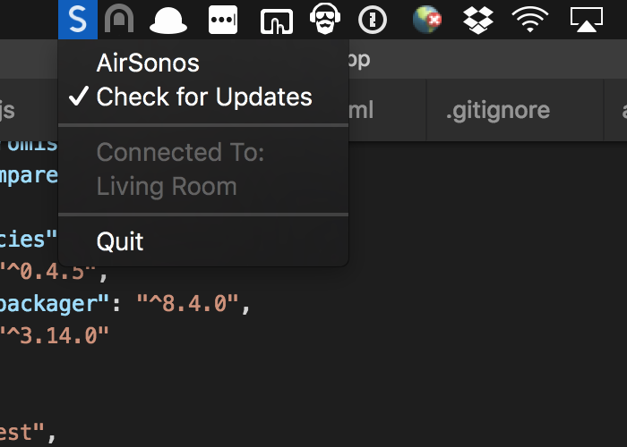
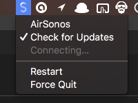

# AirSonos.app
A front end application for [AirSonos](https://github.com/stephen/airsonos)

# Download
[Click here to dowload the latest release of AirSonos.app](https://github.com/mermaid/AirSonos.app/releases/)

# Screenshots (out of date, they have more cool features now!)
| click | option + click |
|-------|----------------|
| | |

# Debuggin common Problems
### Here are some common things that can cause issues with AirSonos. Before submitting issues, please try these to see if any of these steps can fix your issues
 - Make sure you're not using a bridge
   - [You no longer need a bridge for nearly any sonos setup](https://smarthomesounds.co.uk/blog/faqs/do-i-need-a-sonos-bridge-or-boost.php)
 - disable UPnP on your router
 - disable the firewall on the mac
 - disable the firewall on your router
 - stop antivirus (if any)

 you can get debug logs by option+click and selcting "Collect Debug Logs"

